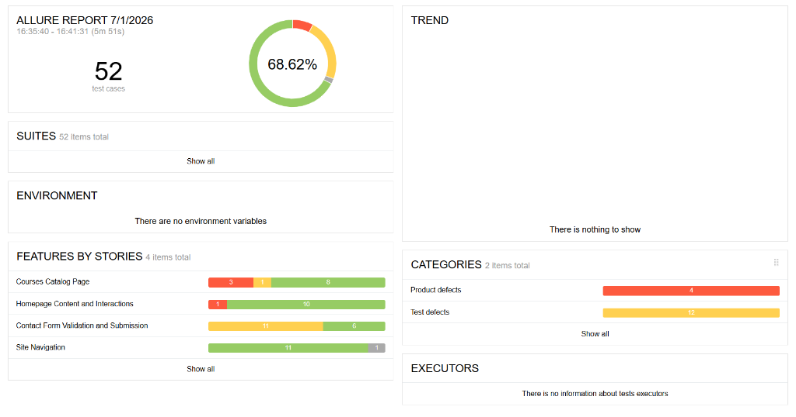
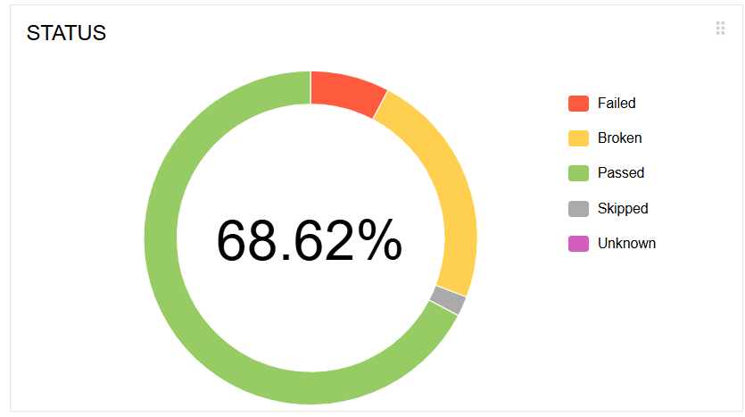
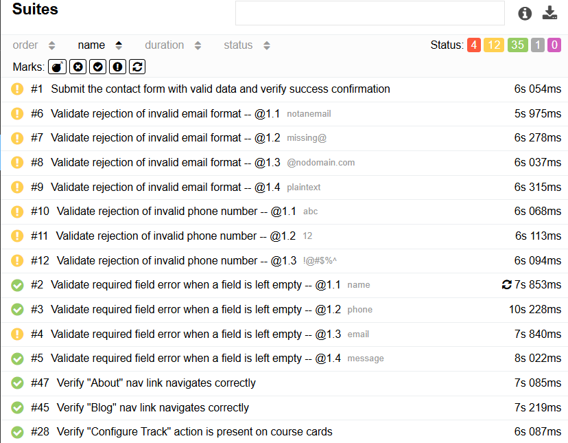

# SkillMantra Selenium BDD Automation Framework

Production-grade test automation suite for [skillmantraedu.com](https://skillmantraedu.com) built using Python, Selenium WebDriver, and Gherkin (behave BDD).



---

## Tech Stack

- **Language:** Python 3.11+
- **BDD Framework:** behave (Gherkin syntax)
- **Browser Automation:** Selenium WebDriver 4.x
- **Pattern:** Page Object Model (POM)
- **Reporting:** Allure Reports & behave-html-formatter

---

## Project Structure

```text
skillmantra_automation/
├── .github/workflows/
│   └── tests.yml               # GitHub Actions CI pipeline
├── assets/                     # Documentation assets (reports screenshots)
│   ├── allure_dashboard.png
│   ├── allure_status.png
│   └── allure_suites.png
├── config/
│   └── config.ini                  # Default configurations (browser, timeout)
├── features/
│   ├── steps/                      # Step definitions
│   │   ├── contact_steps.py
│   │   ├── courses_steps.py
│   │   ├── home_steps.py
│   │   └── navigation_steps.py
│   ├── contact_form.feature        # Feature files (Gherkin Scenarios)
│   ├── courses_page.feature
│   ├── environment.py              # Hooks (before/after hooks, screenshots)
│   ├── home_page.feature
│   └── navigation.feature
├── pages/                          # Page Object Model classes
│   ├── base_page.py                # Reusable Selenium wrappers
│   ├── contact_page.py
│   ├── courses_page.py
│   └── home_page.py
├── utils/                          # Utility modules (logging, factory, config)
│   ├── config_reader.py
│   ├── driver_factory.py
│   └── logger.py
├── .env.example                    # Environment variable template
├── .gitignore                      # Git ignored files
├── behave.ini                      # behave configuration settings
└── requirements.txt                # Python package dependency list
```

---

## Getting Started

### 1. Clone the repository
```bash
git clone https://github.com/Grishma1245/SkillMantra_WebsiteTesting.git
cd skillmantra_automation
```

### 2. Create and Activate Virtual Environment
```bash
# Windows
python -m venv myenv
myenv\Scripts\activate

# macOS / Linux
python3 -m venv myenv
source myenv/bin/activate
```

### 3. Install Dependencies
```bash
pip install -r requirements.txt
```

### 4. Environment Variables (Optional)
Copy `.env.example` to `.env` to override default settings (e.g. browser, headless mode, etc.).
```bash
copy .env.example .env
```

---

## Running Tests

Execute all commands from the `skillmantra_automation` directory.

### Run All Tests
```bash
behave
```

### Run Smoke Tests
```bash
behave --tags=@smoke
```

### Run Regression Tests
```bash
behave --tags=@regression
```

---

## Generating Reports

### 1. HTML Report
```bash
behave -f behave_html_formatter:HTMLFormatter -o reports/report.html
```

### 2. Allure Report (Requires Allure CLI installed)
```bash
# Run tests and output Allure JSON results
behave --no-junit -f allure_behave.formatter:AllureFormatter -o reports/allure-results

# Generate HTML report dashboard
allure generate reports/allure-results --clean -o reports/allure-report

# Open HTML report in default browser
allure open reports/allure-report
```

#### Previews:
| Status Overview | Suites Execution |
| --- | --- |
|  |  |


*Created for SkillMantra Automation*
